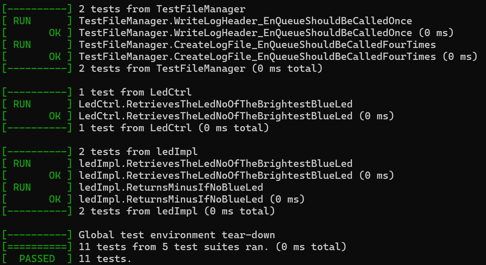
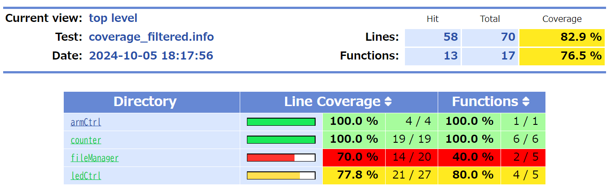

# GoogleTest unit test code sample for embedded software

This repository contains unit test code samples for embedded software. I use GoogleTest as a testing framework for C. It includes examples of using test doubles such as dummy, stub, and mock to isolate hardware dependencies specific to embedded software.

## Prerequisites

Install GoogleTest and GoogleMock. Please refer to the official GoogleTest documentation.

[https://google.github.io/googletest/quickstart-cmake.html](https://google.github.io/googletest/quickstart-cmake.html)

Install other tools

```bash
sudo apt install cmake build-essential lcov
```

## Run test suite

```bash
./runTests.sh
```



## Generate Coverage Report

```bash
./runTests.sh --coverage
```


